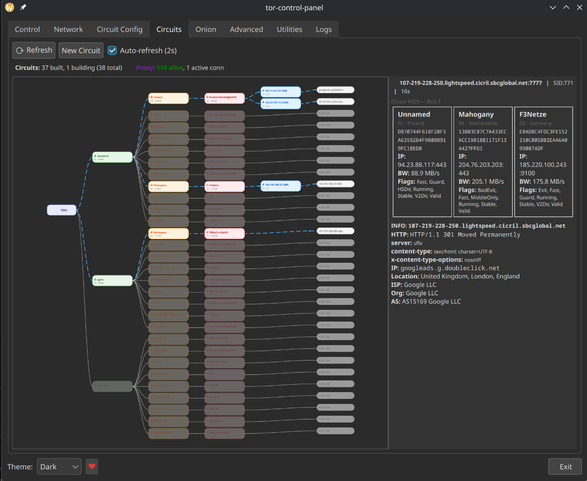
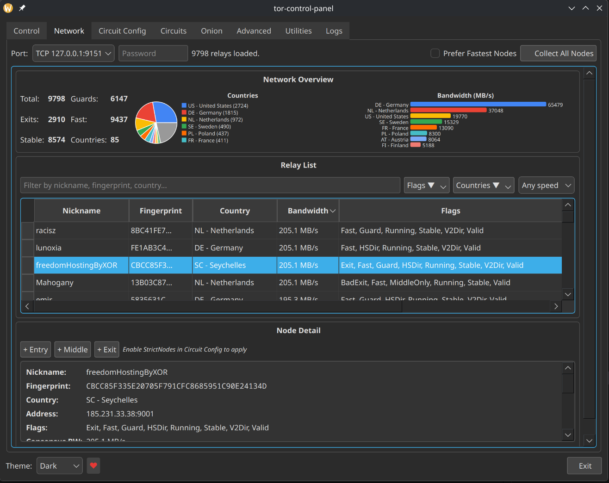
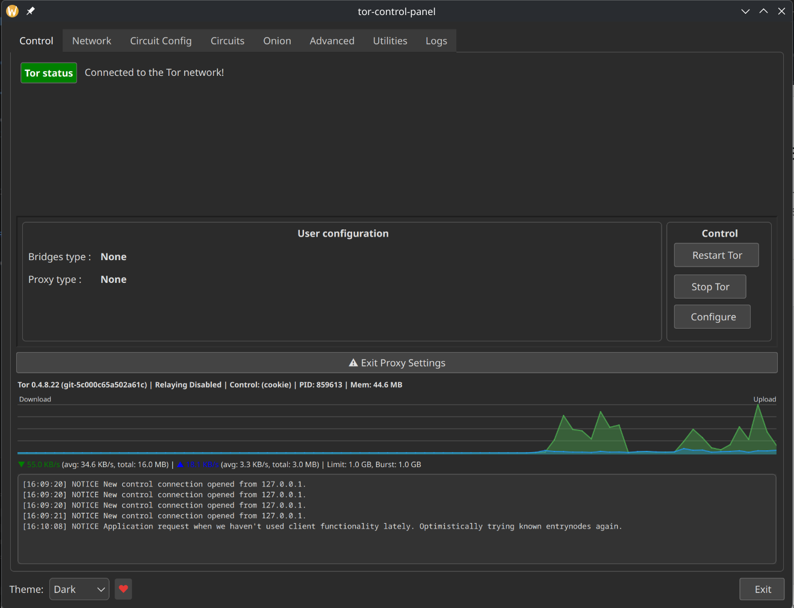
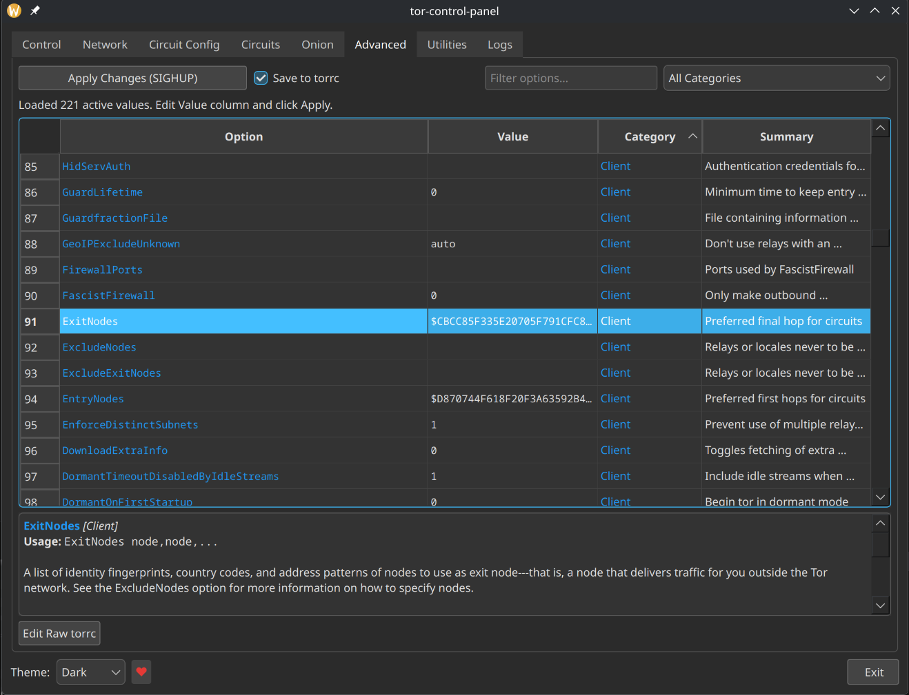
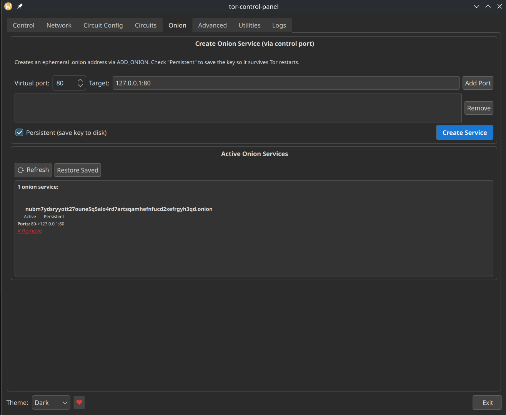
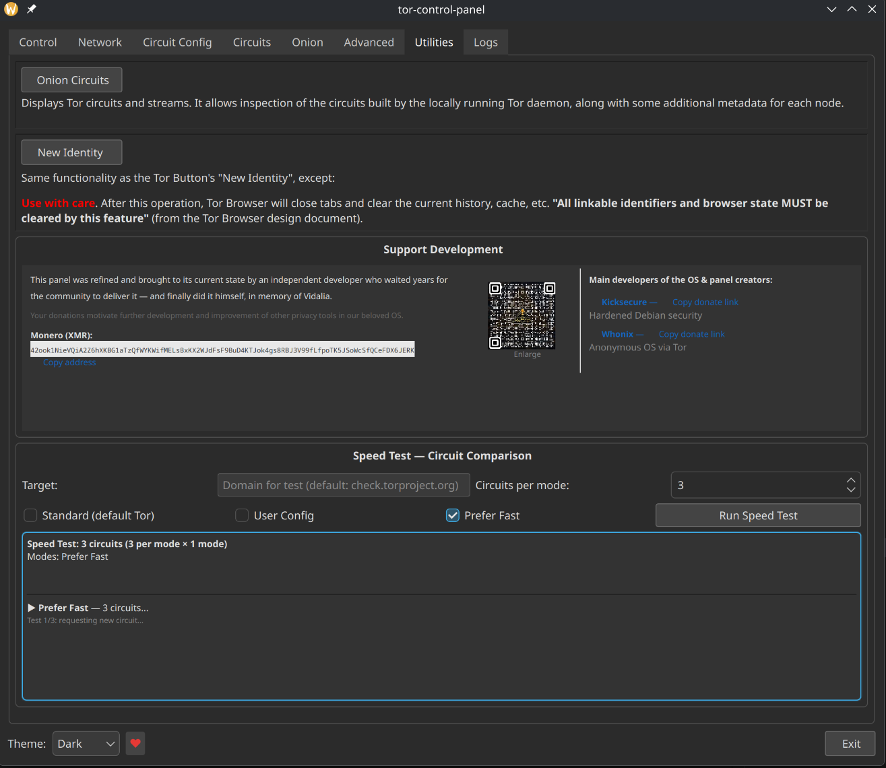
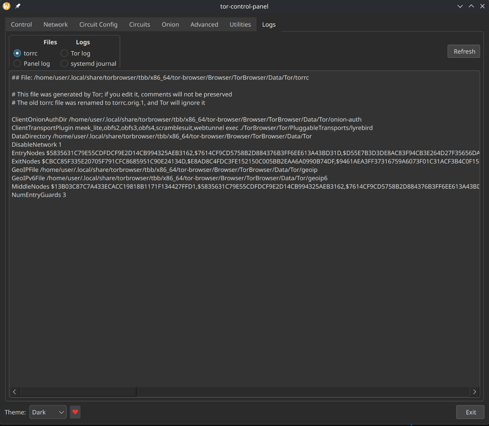

# Tor Control Panel — Advanced Tor Management GUI #

A powerful graphical interface for managing Tor connections, circuits, proxies, and hidden services. Works on **Whonix** (Gateway & Workstation) and **standard Linux** distributions (Debian, Ubuntu, Fedora, etc.).

tor-control-panel is produced independently from the Tor anonymity
software and carries no guarantee from The Tor Project about quality,
suitability or anything else.

Tested on **Fedora 41** (with Tor Browser) and **Whonix 17** (Gateway & Workstation).

## Screenshots ##

<table>
<tr>
<td width="50%"><b>Circuits — Interactive Visualization</b><br></td>
<td width="50%"><b>Network — Relay Browser (~9800 nodes)</b><br></td>
</tr>
<tr>
<td><b>Circuit Config — Node Selection</b><br></td>
<td><b>Circuit Config — Exit Proxy</b><br></td>
</tr>
<tr>
<td><b>Control — Status & Bandwidth</b><br></td>
<td><b>Advanced — torrc Editor</b><br></td>
</tr>
<tr>
<td><b>Onion Services (non-Whonix)</b><br></td>
<td><b>Utilities — Speed Test & Donations</b><br></td>
</tr>
<tr>
<td colspan="2"><b>Logs — torrc, Tor log, Panel log, systemd journal</b><br></td>
</tr>
</table>

## Features ##

### All Platforms (Whonix + Standard Linux)

- **Interactive Circuit Visualization** — zoomable, pannable circuit graph with animated traffic flow. Click any node to see flags, bandwidth, uptime, contact info, and exit policy. Click any stream target to see HTTP headers, IP geolocation, ISP, and AS info fetched through Tor. Auto-refresh every 2 seconds. Recently closed connections stay visible for ~15 seconds with a visual indicator.
- **Relay Browser** — browse all ~9800 Tor relays with instant loading (`QTableView` model architecture — no UI freeze). Filter by text, flags (Guard, Exit, Stable, Fast, etc.), country, and minimum bandwidth. Click any relay to see full details and pin it as Entry, Middle, or Exit node.
- **Circuit Configuration** — pin specific Entry, Middle, or Exit nodes by fingerprint. Include or exclude countries with searchable multi-checkbox menus. Set circuit length (3–8 hops). "Prefer Fastest" mode auto-selects highest-bandwidth relays distributed across selected countries.
- **Speed Testing** — compare circuit performance across Standard (default Tor), User Config, and Prefer Fast modes. Measures latency and throughput through different circuit configurations.
- **Advanced torrc Editor** — full parameter editor organized by category with descriptions. Edit values inline, apply live via `SETCONF` + `SIGNAL SIGHUP` without restarting Tor. View and edit raw torrc file.
- **Theme Support** — Light, Dark, and System themes. Dark theme properly styles all components including the circuit graph, relay table, headers, and detail panels.
- **Logs** — view torrc file, Tor log, internal panel log, and systemd journal in one place.

### Non-Whonix Only

- **Post-Tor Exit Proxy** — transparently route all traffic through external SOCKS5/HTTP proxies *after* the Tor exit node. Traffic flow: `App → Tor → Exit Node → Exit Proxy → Destination`. The destination sees the proxy IP, not the Tor exit IP. No browser configuration needed — Tor's SocksPort is intercepted automatically.
  - Add proxies individually or bulk-import proxy lists
  - Validate all proxies through Tor with configurable concurrency and timeout
  - Auto-remove dead proxies, periodic health re-checks
  - Verify exit IP through multiple independent services
  - **Domain rotation** — different Tor circuits per domain via `IsolateSOCKSAuth` to prevent identity correlation
  - **Domain binding** — pin specific domains to specific trusted proxies
  - **Proxy mode** — "All traffic" or "Selected domains only"
  - **Crash recovery** — if the panel crashes while intercepting Tor's SocksPort, startup recovery automatically restores the original port and repairs the torrc file (prevents Tor Browser breakage)
- **Onion Service Management** — create ephemeral `.onion` hidden services via `ADD_ONION` with optional persistent key storage. Manage ports, view addresses, delete services — all from the GUI.

> **Whonix users:** Exit Proxy and Onion Service features are strictly disabled on Whonix to preserve stream isolation and the distribution's security model. 12 independent defense-in-depth guards prevent these features from executing, even if triggered programmatically.

## Setup Recommendations ##

### For Whonix Users
The panel works out of the box on Whonix. Install via the package manager:
```
sudo apt-get install tor-control-panel
```

### For Standard Linux Users (Debian/Ubuntu/Fedora)

For full functionality, the following setup is recommended:

1. **Tor must be running** with a ControlPort enabled. Add to `/etc/tor/torrc`:
   ```
   ControlPort 9051
   CookieAuthentication 1
   ```
   Then restart Tor: `sudo systemctl restart tor`

2. **Cookie authentication access** — the user running the panel needs read access to Tor's cookie file:
   ```
   sudo usermod -aG debian-tor $USER
   ```
   (Log out and back in for group changes to take effect. On Fedora, the group is `toranon`.)

3. **torrc write access** — to save circuit configuration from the panel, the user needs write access to the torrc file. Options:
   - Grant group write: `sudo chmod g+w /etc/tor/torrc && sudo chown root:debian-tor /etc/tor/torrc`
   - Or use the Advanced tab's "Apply" button which uses `SETCONF` (runtime-only, doesn't persist across Tor restarts)

4. **nftables** (optional, for Exit Proxy feature) — the package includes a sudoers file that allows passwordless execution of the firewall helper script. Ensure `nftables` and `sudo` are installed:
   ```
   sudo apt-get install nftables sudo
   ```

5. **Tor Browser users** — the panel auto-detects Tor Browser's control port. No additional setup needed. The panel works alongside Tor Browser without conflicts.

### For Developers / Maintainers
- The panel detects Whonix via `/usr/share/anon-gw-base-files/gateway` and `/usr/share/anon-ws-base-files/workstation`
- All firewall manipulation is performed through `usr/libexec/tor-control-panel/tcp-firewall-helper` with strict input validation (port range, interface name regex, address length limits)
- The sudoers file (`debian/sudoers_files/tor-control-panel`) grants `%sudo` group passwordless access to the helper only
- The privileged helper is never invoked on Whonix — all callers are guarded

## Security Architecture ##

### Whonix Feature Isolation
On Whonix, Exit Proxy and Onion Service code paths are blocked by 12 independent guards at every level (UI hiding, toggle blocking, server startup prevention, config persistence blocking, crash recovery skipping). Tor's SocksPort is never modified on Whonix. Stream isolation is fully preserved.

### Privileged Helper
The `tcp-firewall-helper` script handles nftables operations. It is invoked via `sudoers` (passwordless) or `pkexec` (GUI prompt). Input validation enforces: port range 1–65535, interface name regex + 32-char limit, address regex + 128-char limit, positive handle validation. Only specific nft table/chain/family combinations are allowed.

### SocksPort Crash Recovery
If the panel crashes while intercepting Tor's SocksPort, startup recovery detects the corrupted state and restores the original port. The torrc file is also repaired on disk. Special handling for Tor Browser: if Tor was launched with `+__SocksPort` on the command line, the SocksPort line is deleted from torrc (not replaced) to prevent duplicate bind errors.

## Future Plans ##

- **VPN & Proxy Chain Management Panel** — a dedicated interface for convenient, reliable, and secure management of VPN and proxy chains on Whonix Gateway or Workstation. This will allow users to set up proxies/VPNs *before* Tor (User → VPN → Tor → Internet) and *after* Tor (User → Tor → Proxy → Internet) with a user-friendly GUI. This may be implemented as a separate package pending review by the Whonix maintainers.

## How to install `tor-control-panel` using apt-get ##

1\. Download the APT Signing Key.

```
wget https://www.kicksecure.com/keys/derivative.asc
```

Users can [check the Signing Key](https://www.kicksecure.com/wiki/Signing_Key) for better security.

2\. Add the APT Signing Key.

```
sudo cp ~/derivative.asc /usr/share/keyrings/derivative.asc
```

3\. Add the derivative repository.

```
echo "deb [signed-by=/usr/share/keyrings/derivative.asc] https://deb.kicksecure.com trixie main contrib non-free" | sudo tee /etc/apt/sources.list.d/derivative.list
```

4\. Update your package lists.

```
sudo apt-get update
```

5\. Install `tor-control-panel`.

```
sudo apt-get install tor-control-panel
```

## How to Build deb Package from Source Code ##

Can be build using standard Debian package build tools such as:

```
dpkg-buildpackage -b
```

See instructions.

NOTE: Replace `generic-package` with the actual name of this package `tor-control-panel`.

* **A)** [easy](https://www.kicksecure.com/wiki/Dev/Build_Documentation/generic-package/easy), _OR_
* **B)** [including verifying software signatures](https://www.kicksecure.com/wiki/Dev/Build_Documentation/generic-package)

## Contact ##

* [Free Forum Support](https://forums.kicksecure.com)
* [Premium Support](https://www.kicksecure.com/wiki/Premium_Support)

## Donate ##

`tor-control-panel` requires [donations](https://www.kicksecure.com/wiki/Donate) to stay alive!
